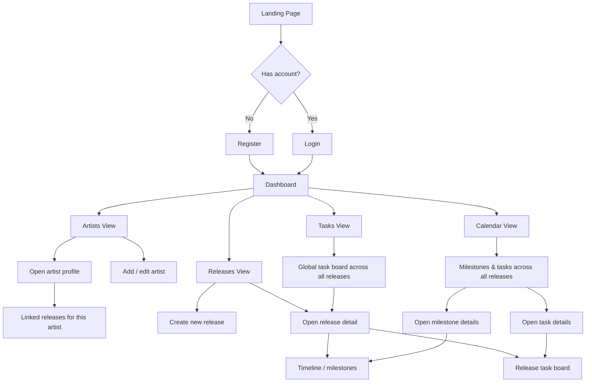

# Cadence — Music Release Planner

🔗 **Frontend repo:** [cadence-frontend](https://github.com/danielmuntyanu/cadence-music-release-planner-frontend)
🔗 **Backend repo:** [cadence-backend](https://github.com/danielmuntyanu/cadence-music-release-planner-backend)

## Project Concept

Cadence is a planning and coordination tool built for independent musicians and small labels to manage the full lifecycle of a music release — not just as a status tracker, but as a **timeline-driven planner** for everything that happens around a release: mastering deadlines, artwork approval, distribution windows, promo posts, and more.

Most artists currently juggle this process across spreadsheets, sticky notes, and DMs. Cadence consolidates it into a single, structured workspace where each release becomes a project with its own calendar, task board, and progress view.

## Description

At its core, Cadence models a **release** as a central entity with:
- A timeline of key dates (recording done, mixing, mastering, artwork, submission, release day, promo push)
- A set of tasks tied to each milestone, assignable and trackable via a Kanban board
- A calendar view that aggregates tasks and milestones across all active releases

The application is a full-stack web app with a Vue 3 frontend and a Spring Boot REST API backend, built as a capstone project for a Java Full-Stack Developer Bootcamp — with an eye toward being genuinely usable afterward, not just a demo.

**Tech stack:**
- **Frontend:** Vue 3, Vuetify, Tailwind CSS, Axios, Vitest, Playwright
- **Backend:** Java 21 (LTS), Spring Boot, Spring Web, Spring Data JPA, JWT authentication
- **Database:** MySQL

## User Flow 

## MVP Features

- **Authentication & Security** — user registration/login, JWT-based auth, protected API routes
- **Landing Page** — public-facing project introduction and entry point
- **Release Management** — create, edit, and view releases with core metadata (title, type, target date)
- **Release Timeline** — define and edit key milestone dates per release
- **Task Board** — Kanban-style task management scoped to a release (To Do / In Progress / Done)
- **Calendar View** — unified calendar showing milestones and tasks across all releases
- **REST API** — documented endpoints covering releases, tasks, and auth
- **Test Suite** — unit tests (Vitest, JUnit) and E2E coverage (Playwright) for critical flows

## Roadmap

### Phase 1 — Foundation
- Project initialization (frontend + backend scaffolding, CI setup)
- Authentication & authorization (JWT, protected routes)
- Landing page

### Phase 2 — Releases
- Release entity CRUD
- Release timeline / milestone structure
- Release detail view

### Phase 3 — Planning
- Task creation and Kanban board per release
- Calendar view aggregating tasks and milestones
- Task-to-milestone linking

### Phase 4 — Post-MVP
- File attachments (artwork, mix references)
- Notifications/reminders for upcoming milestones
- AI-features to improve creativity and efficiency